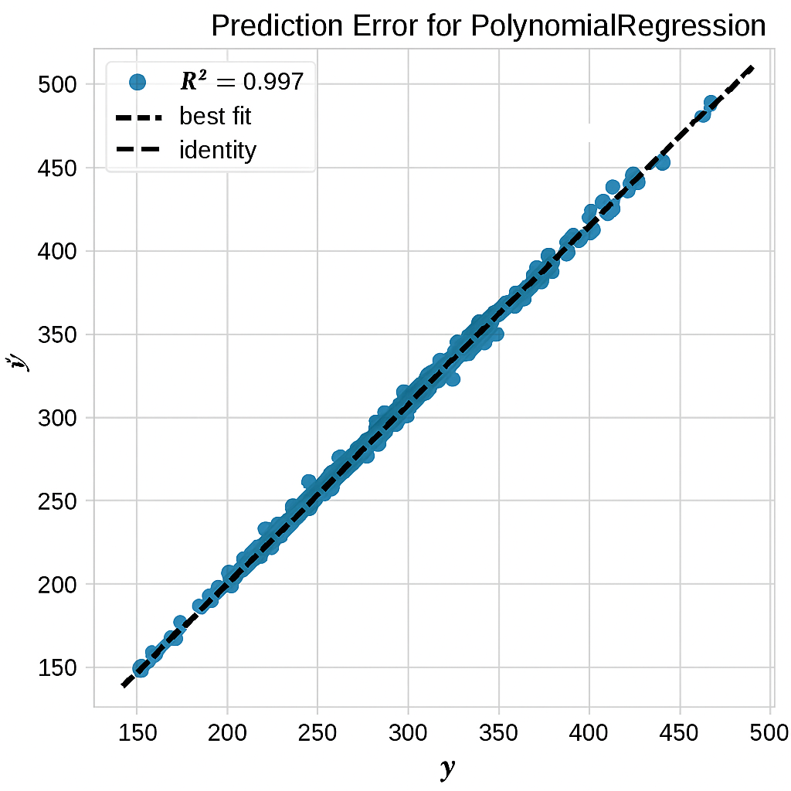
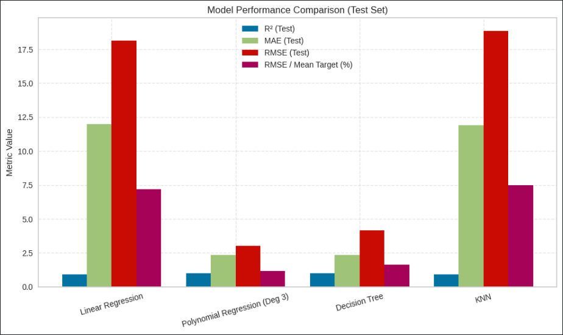

# CO2-Emission-by-Vehicles-Prediction
Comprehensive data analysis and regression techniques for predicting CO₂ emissions of vehicles in Canada.

## **📌 Project Overview**
This project focuses on analyzing and modeling vehicle CO₂ emissions using a real world dataset from Canada. The primary goal is to understand the structure and relationships within the data, and then build a reliable machine learning model that can accurately predict CO₂ emissions based on vehicle characteristics.

## **🗂️ Dataset Description**
Size: 7,385 rows × 12 columns

Key Fetures:

**Make:** The brand of the vehicle (e.g., Toyota, Ford).

**Model:** Includes specific identifiers such as drivetrain or fuel flexibility (e.g., AWD, FFV).

**Vehicle Class:** Categorizes vehicles by size and type, such as compact cars, SUVs, pickup trucks, and vans.

**Engine Size (L):** The engine displacement measured in liters.

**Cylinders:** Number of cylinders in the engine, often correlated with engine power and fuel consumption.

**Transmission:** Indicates the type of gearbox, including automatic (A), manual (M), continuously variable (AV), and others.

**Fuel Type:** Specifies the fuel used — regular gasoline (X), premium gasoline (Z), diesel (D), ethanol (E), or natural gas (N).

**Fuel Consumption City / Hwy / Comb (L/100 km):** Fuel usage in different driving conditions — city, highway, and combined.

**Fuel Consumption Comb (mpg):** Combined fuel efficiency in miles per gallon. Higher mpg values indicate better fuel economy.

**CO₂ Emissions (g/km):** The target variable, representing the amount of carbon dioxide emitted per kilometer.

## **📊 Exploratory Data Analysis (EDA)**
In order to get a solid feel for the data before modeling, we kicked things off with an exploratory analysis. The goal was to uncover how different vehicle features connect to CO₂ emissions and fuel efficiency spotting patterns, trends, and relationships that could shape a smarter prediction model.

🔍 Key Observations

**Fuel Consumption & Emissions**: There is a strong positive correlation between fuel consumption (city, highway, combined) and CO₂ emissions. Vehicles that consume more fuel tend to emit more CO₂.

**Fuel Efficiency (mpg):** A clear negative relationship exists between fuel efficiency and emissions. Vehicles with higher mpg values are more efficient and produce less CO₂.

**Engine Size & Cylinders:** Larger engines and more cylinders generally result in higher fuel consumption and emissions. These features are strong predictors of environmental impact.

**Vehicle Class Trends:** Smaller vehicles (e.g., compact, subcompact) tend to be more fuel-efficient, while larger classes (e.g., SUVs, pickup trucks) show higher emissions.

**Transmission & Fuel Type Patterns:** Transmission type and fuel type influence fuel economy. For example, diesel engines often have better fuel efficiency but may not always result in lower emissions. Manual transmissions can offer better control and efficiency in certain vehicle classes.

**Feature Interactions:** Some features interact in meaningful ways — for example, engine size combined with vehicle class can amplify or reduce emissions depending on the configuration.

## **🔧Machine Learning Models**
To predict CO₂ emissions based on vehicle features, four regression models were developed , evaluated and compared to each other .

**1 - Simple Linear Regression**

**2 - Polynomial Regression**

**3 - Decision Tree Regressor**

**4 - K-Nearest Neighbors Regressor (KNN)**

**Final Model:**

Polynomial Regression was chosen as the final model due to its consistently strong and stable performance in capturing non-linear relationships between vehicle features and CO₂ emissions.

## **📈 Models Evaluation**

| **Metric**                         | **Linear Regression** | **Polynomial Regression** | **Decision Tree Regressor** | **KNN Regressor** |
|:----------------------------------:|:---------------------:|:---------------------------------:|:----------------------------:|:-----------------:|
| R² Score (Train)                  | 0.9173                | 0.9978                            | 0.9978                       | 0.9454            |
| R² Score (Test)                   | 0.9090                | 0.9975                            | 0.9975                       | 0.9014            |
| MAE (Train)                       | 11.1564               | 2.0835                            | 2.0835                       | 8.6081            |
| MAE (Test)                        | 11.9801               | 2.3409                            | 2.3409                       | 11.8955           |
| RMSE (Train)                      | 16.9949               | 2.7768                            | 2.7768                       | 13.8096           |
| RMSE (Test)                       | 18.1184               | 3.0052                            | 3.0052                       | 18.8606           |
| RMSE / Mean Target Ratio (Train) | ~6.77%                | ~1.11%                            | ~1.11%                       | ~5.68%            |
| RMSE / Mean Target Ratio (Test)  | ~7.21%                | ~1.20%                            | ~1.20%                       | ~7.21%            |

## **📂 Dataset**

Kaggle Dataset URL: https://www.kaggle.com/datasets/debajyotipodder/co2-emission-by-vehicles/data

## **📄 License**

This project is licensed under the MIT License – see the [LICENSE](LICENSE) file for details.

## **👩‍💻 Contact**

📌 Project by: Nazanin Mahmoudy, 2025                                   
📧 Email: Nazaninmahmoudy@gmail.com                                        
🔗 GitHub: https://github.com/Nazaninmahmoudi                                        
🔗 Kaggle: https://www.kaggle.com/nazaninmahmoudy                                                    
